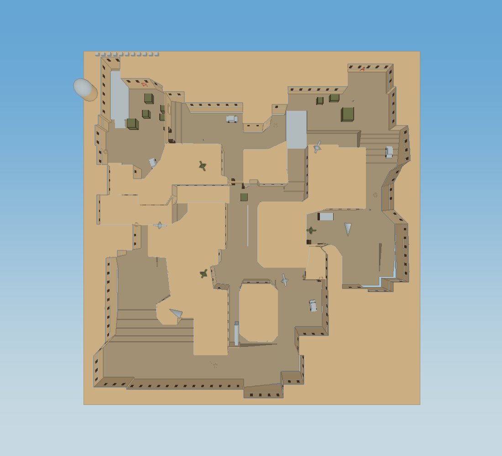
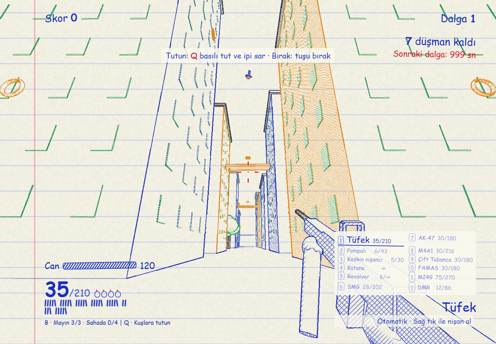

# DoodleShooter Remix

**13 maps, 11 guns, a katana, and grappling through the sky.** Survive waves on your own or challenge friends in online free for all, team elimination, or Team Deathmatch.

## Original game and credits

This is a community remix of **[DoodleShooter by iifor](https://github.com/iifor/doodleshooter)**. Thanks to the original creator and contributors for the game this project builds on. Credits and links also appear in the main menu.

- **Play the original:** [doodleshooter.vercel.app](https://doodleshooter.vercel.app/)
- **Original source:** [iifor/doodleshooter](https://github.com/iifor/doodleshooter)
- **Remix source:** [Rekl0w/doodleshooter-remix](https://github.com/Rekl0w/doodleshooter-remix)
- The [original README](docs/UPSTREAM_README.md) and upstream Git history are preserved.

## Features

- **13 maps:** compact VS arenas, large dense forests, a Dust 2 adaptation, and a city with 24 towers, and two enclosed team arenas.
- **Weapons:** rifle, shotgun, sniper, revolver, SMG, AK-47, M4A1, dual pistols, FAMAS, M249, DMR, and katana.
- **Clearer SMG aiming:** raised thin-frame sight and more eye relief keep the gun below the center view.
- **Adjustable scopes:** sniper 2× / 4× / 8×; DMR 2× / 3× / 4× / 6×.
- **Grappling:** hold Q to attach and reel in; release to carry your momentum. Flying ducks and swallows can carry you too.
- **Grenades and mines:** expanded blast areas, cover-aware damage, and online synchronization.
- **Solo resupply:** improved ammo drops, katana kill rewards, and unlimited revolver reserve ammo.
- **English by default, optional Turkish:** use **Language / Dil** in the main menu. Your choice is saved locally; changing language reloads the menu. Players using different languages can share the same lobby.
- **Two visual styles on every map:** after selecting a map, choose **Lined notebook** or **Solid colors**. Solid mode removes paper lines, crosshatching, and outline wobble, with richer turquoise, terracotta, wood and foliage colors. Team characters use dedicated red and blue colors. Your preference is saved per map and only affects your own view, including online games.
- **Online feedback:** hit markers confirm damage accepted by the host, with clear spawn-protection feedback. Player names follow visible opponents and stay hidden behind cover.
- **Respawning in free for all and Team Deathmatch:** after the countdown, click **Respawn** or press Space / Enter. Mouse movement and held buttons do not respawn you accidentally.
- Mouse sensitivity, inverted look, music settings, map previews, and gamepad support.
- Fixes for repeated wall jumping, weapon poses, reload states, and leaving map boundaries.

## Controls

| Action | Input |
| --- | --- |
| Move / look | WASD / mouse |
| Sprint / slide | Shift / C |
| Fire / slash | Left mouse button |
| Aim / block with katana | Right mouse button |
| Jump / leap off the rope | Space |
| Grapple and reel in | Hold Q; release to detach |
| Quick katana | F or V |
| Reload | R |
| Grenade | G; hold to throw farther |
| Place mine | B |
| Select weapon | 1–9, 0, or mouse wheel |
| Scope zoom | Mouse wheel or + / − while aiming |
| Scoreboard | Tab |
| Menu / music | Esc / M |

C is the crouch/slide key; Ctrl is reserved for browser shortcuts. Leaving or reloading an active game asks for confirmation to protect against accidental tab closure.

Use the wheel to reach M249 and DMR. E does not reel in the rope. Gamepad bindings are listed in the in-game **Controls** section.

## Maps

| Map | Setting |
| --- | --- |
| Doodle District | Streets, rooftops, and fire escapes |
| Container Harbor | Containers, cranes, and narrow lanes |
| Paper Canyon | Open sightlines and terraces |
| Rooftop Gardens | Elevated parks linked by bridges |
| Pine Valley | A wide clearing surrounded by woodland |
| Forest Duel | A small, symmetric VS arena |
| Lakeside | Piers and open meadows |
| Deep Forest | 288 × 288; dense pines, rocks, and cabins |
| Lost Woods | 352 × 352; ruins and plenty of hiding places |
| Dust 2 · Remix | Radar-based long, short, mid, A/B sites, and tunnels |
| Skyline City | 24 buildings, 24 safe rooftop spawns plus 10 street spawns, elevated bridges, and grappling routes |
| Foundry | Three routes around machine halls, shielded spawn rooms, and close cover |
| Old Quarter | Winding alleys, covered passages, courtyards, and protected spawns |




The Dust 2 screenshot shows this remix's current geometry. The added staircase/ramp between CT and A has been removed; the existing short bridge and long approach remain. Invisible outer boundaries prevent falling out of the map.

Dust II is based on **Counter-Strike / Valve** references: [Valve's Dust II presentation](https://www.counter-strike.net/dust2/) and the [CS2 radar layout](https://cs2caller.com/dust2/callouts). Geometry in this project is generated in code; it does not include CS2's original models, textures, exact dimensions, or bomb-defusal mode.

## Play with friends

1. Everyone opens the same up-to-date game URL.
2. Choose **ONLINE → Private · Friends → Create room**.
3. Share the room code; friends enter it and press **Join**.
4. The **host** chooses **Game mode**, the map, **Allow katana**, and the score/round target, then presses **Start match**. Guests wait for the host; they cannot start the match or change the map.

After the map is selected, each player can choose their own visual style below the map cards.

Up to **25 players**. Free for all and Team Deathmatch use a host-selected target of **1–999 kills** (default: 20); team elimination uses round wins. Joining a match already in progress is supported. Use **Quick play** to find public rooms.

PeerJS handles discovery and WebRTC carries player traffic. The host's browser runs the match. This release uses the `v12` room namespace so older gameplay versions cannot join it. Internet access is required; some NAT/firewall configurations may block direct connections. The host applies the temporary anti-cheat and visibility rules described below; a dedicated server is still required for a fully trusted authority.

### Team modes

Choose **Game mode** in the lobby. Players choose **Red team** or **Blue team**; the host can assign anyone. New arrivals are balanced automatically. Each side supports 13 players, within the room total of 25. Teams lock when the match starts and friendly fire is disabled, including grenades, mines and rope cutting.

- **Team elimination:** first **16 round wins** by default; the host can choose **1–99**. Everyone respawns together with full health and supplies. A round starts with a three-second freeze, lasts up to two minutes, and ends when one team is eliminated. At timeout, more survivors wins; equal survivor counts use remaining total health, and an exact tie draws. No passive healing. Eliminated players watch a living teammate and wait; late arrivals also wait for the next round. Sides swap after `target − 1` completed rounds. This mode offers **Dust 2, Foundry and Old Quarter**, with 13 safe spawns per side and no spawn-to-spawn sightline. It is elimination, not bomb defusal.
- **Team Deathmatch:** kills accumulate for the whole team. The host chooses a **1–999 kill target** (default 20); the ten-minute timer also applies. Players use the normal respawn countdown and can join a running match immediately. All **13 maps** are available, including Skyline City's rooftop spawns. Team totals persist when a player leaves. At timeout the higher team score wins; equal scores draw.
- If the last member of a team leaves an elimination match, the other team wins by forfeit. If the host leaves, the room ends.

### Moderation and temporary anti-cheat

- The host can **Kick** a player from the lobby or the in-match **Esc → Menu → Manage players** panel. Removing a player closes their connection and removes them from every roster. The current room remembers their peer ID and browser ID; changing only their name does not bypass removal.
- **Kill target** is set by the host before each match and stays fixed during the match. The chosen target is shown to all players, including late joiners. The existing 10-minute match timer still applies.
- **Allow katana** is set before each match. Disabled katana is skipped by weapon cycling and quick melee, and the host rejects katana damage. Late joiners inherit the same rule.
- The host owns health, spawn protection, accepted damage, deaths, scores and respawns. Hit proposals are checked for the host-approved weapon ledger, weapon damage, per-weapon cadence, a global shot bucket that survives weapon switches, replay, life generation, range, cover, and consistency between aim, bullet direction and impact position. Snapshot weapons cannot overwrite that ledger, and movement is bounded by a grapple-aware distance and apparent-speed limit. Grenades and mines damage players through host simulation; health pickups and regeneration also use the host ledger.
- A modified guest cannot stay alive for everyone else by ignoring damage or forging health, death, invisibility or host-control messages. Killing the guest still updates the host score, and attacks from their dead life are rejected.
- **Automatic anti-cheat enforcement:** `src/anti-cheat.js` runs on the host and keeps a short rolling evidence window. Malformed combat packets, forged life generations, replayed hit ids, impossible origins/rays, invalid weapons, cadence bypasses, forged velocity vectors, micro-timestamp speed hacks, wall-crossing snapshots and repeated teleport snapshots are rejected and accumulate deterministic strikes. Same-task WebRTC snapshot bursts are held at the last accepted position instead of being measured as impossible speed; the next spaced packet is checked normally. Repeated extreme snap + head convergence patterns, clustered near-zero trigger timing and smooth near-head locks held across several targets add behavioral evidence; one flick, headshot or sustained lock on one target never kicks. High-confidence aim/trigger/movement evidence automatically removes the guest, closes the connection, removes its combat entity, records host-only evidence and room-bans its peer and stable client id for the lifetime of the room. The removed client sees only **“Removed from match: anti-cheat violation”**.
- **Per-player visibility:** the host sends each peer a snapshot filtered for that recipient. A player fully behind solid cover is represented as an `away` body with no position, aim, weapon, velocity or grapple point; vitals retain only health/life metadata, start packets contain only the recipient's spawn, and tracer packets are withheld while the shooter is hidden. Visibility uses a short confirmation hysteresis, so one edge-of-cover ray does not make a player blink; mine placement and mine-sync packets use the same line-of-sight filter, so hidden traps do not become a wallhack side channel. The full snapshot returns when a line of sight opens consistently. This blocks the useful wallhack feed while preserving normal nameplates and rendering. The host still verifies every shot against its own position, weapon profile, cadence, range, cover, ray and life generation, and ignores client health, damage, fire-rate, cooldown and protection claims.
- **The host must still be trusted.** This is a P2P safeguard, not an uncheatable game: the host browser contains `HostCombat` and `AntiCheat`, so a malicious host can modify match decisions. A guest can still automate inputs that look like valid human input, and a determined user can reconnect with a completely new PeerJS/browser identity. Browser source, assets and screen pixels cannot be made secret from the person running the browser. A future dedicated server can reuse the modular aim history, movement validation, per-recipient visibility and enforcement code.
- The room ends when its host leaves; combat authority is not transferred to another player. These safeguards require no new hosting service or paid backend.

## Run locally

With Python 3:

```bash
python serve.py 8911
```

Open [localhost:8911](http://127.0.0.1:8911/). On Windows, you can also double-click `OYNA.cmd` with Python installed. ES modules require an HTTP server, so do not open the game through `file://`.

## Netlify / static hosting

The game runs entirely in the browser. To prepare a deployment directory with Node.js 22+:

```bash
node scripts/build.mjs
```

This copies only runtime files into `dist/`. Documentation, tests, and local development tools are excluded.

The included `netlify.toml` configures:

- **Branch:** `main`
- **Build command:** `node scripts/build.mjs`
- **Publish directory:** `dist`
- **Environment variables:** none required

Import the GitHub repository into Netlify or upload the generated `dist/` directory manually. Other static hosts can serve the same directory. Cache headers require revalidation so updates are picked up on the next refresh.

## Tests

Start the local server, then use a Playwright installation:

```bash
npm install --no-save --package-lock=false playwright
npx playwright install chromium
node tests/team-rules.mjs
node tests/team-maps.mjs
node tests/teams.mjs
node tests/team-deathmatch.mjs
node tests/host-combat.mjs
node tests/anti-cheat.mjs
node tests/authority.mjs
node tests/anti-cheat-online.mjs
node tests/match-rules.mjs
node tests/run.mjs
node tests/maps.mjs
node tests/expansion.mjs
node tests/dust2.mjs
node tests/ui.mjs
node tests/appearance.mjs
node tests/online.mjs
node tests/multiplayer-regression.mjs
node tests/false-positive-movement.mjs
node tests/production-debug.mjs
```

On Windows, tests use installed Microsoft Edge. Set `GAME_URL` to use another server, or `PLAYWRIGHT_MODULE` to point to an existing Playwright installation. UI and online tests create private rooms and require internet access. Run browser suites sequentially.

Coverage includes movement, ammo, damage, map loading, safe spawns, bot paths, scopes, dual pistols, Dust traversal and boundaries, English/Turkish persistence, lobby card styles, host-only match starts, real two-client WebRTC synchronization, recipient-specific wall visibility with anti-flicker hysteresis and mine redaction/restoration, three-client respawn / hit-acknowledgement / nameplate regressions, a queued snapshot burst plus repeatable 30-second forest movement route at a map boundary, forged velocity and weapon-ledger checks, deterministic anti-cheat strikes, smooth head-tracking detection, weapon cadence and health authority, behavioral scoring/decay, automatic kick and room-ban enforcement, post-kick packet rejection, and production debug-surface removal.

## Technology and contributions

JavaScript ES modules, [Three.js](https://threejs.org/), [PeerJS](https://peerjs.com/), and Web Audio. Most geometry and sound are generated in code. Browser dependencies are vendored under `vendor/`.

UI text uses `ui('Text')` or tagged templates such as `` ui`Score: ${score}` ``. English is the source language; Turkish translations live in `src/locales/tr.js`. Keep numbered placeholders intact and never translate player names or protocol identifiers.

When reporting a bug, include the map, weapon, solo/online mode, and reproduction steps. Preserve the original creator credits in contributions.
